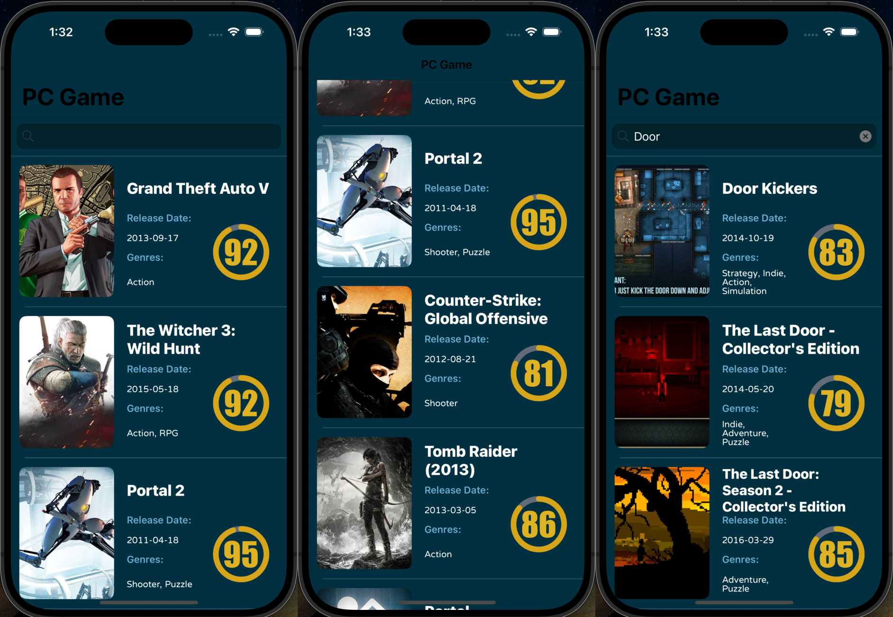
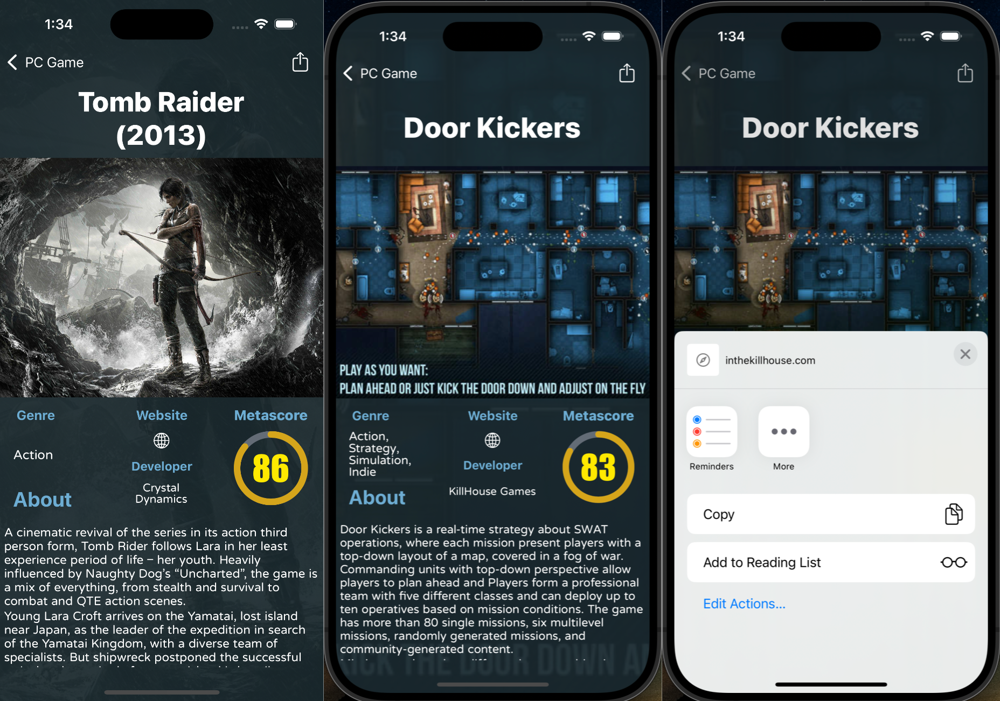

# 🎮 HW_JSONDecoder – RAWG 遊戲資料查詢 App

- 這是一個使用 [RAWG Video Games Database API](https://rawg.io/apidocs) 製作的 iOS 小專案。
- 使用 Swift + UIKit 實作，主要練習 JSON 解碼、API 資料串接與 TableView 資料展示。

---

## 📷 畫面預覽

### 🔍 遊戲清單頁面（含搜尋）



### 📘 遊戲詳細頁面（（圖片、描述、評分圓環、分享、開啟網站））



---

## 🚀 專案目標

1. 練習申請 API Key，閱讀 API 文件與觀察網站資料
2. 選擇合適的 API endpoint，取得 JSON 並進行解析
3. 實作搜尋功能，搜尋特定遊戲資料
4. 使用 `SPM` 安裝第三方套件：Kingfisher，顯示圖片

---

## 🧩 使用技術

- UIKit / Storyboard
- RESTful API 串接（URLSession）
- JSONDecoder + Codable 結構
- UISearchBar + UITableView
- SFSafariViewController（網站開啟）
- Kingfisher（圖片快取）
- 手刻圓環進度條（CAShapeLayer）

---

## 🔄 專案流程概述

1. 在 `AllGameListTableViewController` 中向 RAWG API 請求遊戲清單。
2. 取得清單後，使用每個遊戲的 ID 向 API 預先請求詳細資料。
3. 詳細資料以 `gameDetails[ID]` 字典方式快取儲存。
4. 當使用者點擊 cell，根據該 ID 傳遞詳細資料給 `GameDetailViewController`。
5. 顯示圖片、文字描述、開發商、類型、評分圓環等資訊。

---

## 📡 使用的 API

- `GET /games`：取得遊戲清單，支援搜尋與條件過濾（metacritic, platforms）
- `GET /games/{id}`：取得特定遊戲的詳細資訊

API 文件清楚易懂，且支援免費帳號使用。

---

## 📖 專案相關文章

📘 Medium 教學文章： [從 RAWG API 到 iOS App｜解析與顯示 PC 遊戲資料](https://medium.com/%E5%BD%BC%E5%BE%97%E6%BD%98%E7%9A%84-swift-ios-app-%E9%96%8B%E7%99%BC%E6%95%99%E5%AE%A4/c68-%E5%BE%9Erawg-api%E5%88%B0ios-%E8%A7%A3%E6%9E%90%E5%92%8C%E9%A1%AF%E7%A4%BApc%E9%81%8A%E6%88%B2%E6%95%B8%E6%93%9A-6469d7a7854f)

這篇文章會詳細介紹：

- RAWG API 的基本申請與使用方式
- 如何解析 JSON 並展示在 `UITableView` 中
- 評分圓環進度條的繪製邏輯（`CAShapeLayer`）
- 專案架構與資料傳遞流程整理

---

## 📂 專案結構

以下為本專案的主要目錄結構與檔案功能說明：

```
HW_JSONDecoder/
├── Manager/
│   └── APIKeyManager.swift               // 管理 Secrets.plist 的 API 金鑰讀取
│
├── View Controllers/
│   ├── AllGameListTableViewController.swift   // 顯示遊戲清單與搜尋邏輯
│   └── GameDetailViewController.swift         // 顯示遊戲詳細資訊
│
├── Views/
│   └── GameTableViewCell.swift           // 遊戲 cell UI 設計與設定邏輯
│
├── Models/
│   ├── GameListAPI.swift                 // 遊戲清單 API 的資料模型
│   ├── GameDetailAPI.swift               // 遊戲詳細資料的資料模型
│   └── GameTrailerAPI.swift              // 遊戲預告片 API 模型（目前未使用）
│
├── Secrets.plist.example                // API 金鑰格式範例（請勿提交 Secrets.plist）
├── Assets.xcassets                      // App 所需圖片資源
├── Main.storyboard                      // UI 介面設計（使用 Storyboard）
└── README.md
```

---

## 📦 安裝方式

1. Clone 專案
2. 使用 Xcode 開啟 `.xcodeproj`
3. 安裝依賴（Kingfisher via Swift Package Manager）
4. 確保有建立 Secrets.plist（見下方 🔑 設定）
5. Run 起來！

---

## 🔑 設定 API Key（Secrets.plist）

本專案使用 `Secrets.plist` 儲存 RAWG API 金鑰，避免將金鑰直接寫在程式中。

- 本檔案已被 .gitignore 忽略，請勿上傳至 GitHub。
- 可參考 Secrets.plist.example 範例。

請在專案目錄中新增一個檔案 `Secrets.plist`，內容如下：

```xml
<?xml version="1.0" encoding="UTF-8"?>
<!DOCTYPE plist PUBLIC "-//Apple//DTD PLIST 1.0//EN" 
"http://www.apple.com/DTDs/PropertyList-1.0.dtd">
<plist version="1.0">
<dict>
    <key>RAWG_API_KEY</key>
    <string>your_api_key_here</string>
</dict>
</plist>
```

---

## 📝 備註

- 該專案僅為練習用途，無使用影片 API（免費帳號限制）
- 如果遇到 API 無法連線，請檢查 key 是否有效

---

## 🙋‍♂️ 聯絡我 Contact

- GitHub: [a578ff6](https://github.com/a578ff6)
- Medium: [a578ff6](https://medium.com/@a578ff6)